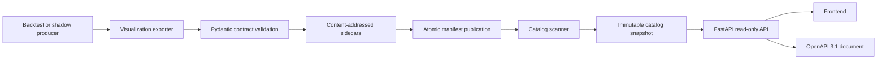

# Strategy Visualization Backend Design

**Status:** Decision-complete design for implementation  
**Contract version:** `1.0.0`  
**API version:** `v1` behavior on the unversioned `/api` path  
**Related specification:** `docs/strategy_visualization_plan.md`

## 1. Purpose

This document defines the complete backend boundary for the Strategy
Visualization Dashboard. It freezes the producer/exporter contract, storage
layout, catalog behavior, HTTP API, error model, caching, concurrency, security,
and frontend handoff.

The frontend may begin detailed design after the schemas, OpenAPI snapshot, and
fixtures defined here exist. It must not depend on Python modules, raw research
CSV files, shadow JSONL logs, or undocumented strategy-specific fields.

The backend is read-only over published visualization bundles. It has no broker
client, account mutation, order, or strategy-execution authority.

## 2. Architectural Decisions

The implementation uses:

- Python 3.10 or newer. The project development environment currently uses
  Python 3.14.
- FastAPI for HTTP routing, OpenAPI 3.1 generation, CORS, and typed responses.
- Pydantic v2 models as the Python source of truth for contract structure.
- Uvicorn as the local ASGI server.
- The local filesystem as the bundle store.
- An immutable in-memory catalog snapshot rebuilt by a background scanner.
- Content-addressed dataset sidecars and atomic manifest replacement.
- Conditional HTTP polling; no WebSocket or server-sent events in version 1.
- No database, queue, authentication provider, or cloud service in version 1.

Dependency policy:

- Add `fastapi[standard]` and `pydantic>=2,<3` as backend dependencies.
- Do not pin Starlette separately; FastAPI owns that compatibility boundary.
- Pin the resolved FastAPI minor series when implementation begins and upgrade
  it only with the backend contract and API tests passing.
- Keep frontend packages out of the Python environment.

Pydantic models generate:

- Runtime validation.
- JSON Schema 2020-12 snapshots for every public bundle object.
- OpenAPI response schemas for the HTTP interface.

Handwritten documentation and generated schema snapshots are verified against
the models in CI so the three representations cannot drift silently.

## 3. Scope

### Included

- Historical backtest visualization export.
- Current shadow-stream visualization export.
- Contract validation and cross-dataset reconciliation.
- Atomic bundle publication.
- Bundle discovery and integrity checking.
- Read-only catalog, manifest, dataset, metadata, and health endpoints.
- OpenAPI, JSON Schema, fixtures, and frontend-facing examples.
- Structured diagnostics and request logging.

### Excluded

- Recalculating strategy indicators in the API.
- Running backtests from HTTP requests.
- Editing strategies, parameters, market data, or results.
- Paper/live order APIs.
- User accounts, remote hosting, and public internet exposure.
- Database persistence.
- WebSockets and push notifications.
- Specialized zone-review and cross-strategy comparison datasets.

## 4. Component Architecture



Implementation modules:

- `ai_trade.visualization_contract`
  - Public Pydantic models, enumerations, field validators, cross-record
    validators, JSON serialization, and schema export.
- `ai_trade.visualization_exporter`
  - Historical/shadow adapters, derived performance construction, hashing,
    content-addressed writes, and manifest publication.
- `ai_trade.visualization_catalog`
  - Root discovery, manifest parsing, integrity checks, duplicate detection,
    catalog snapshots, facets, and scanner diagnostics.
- `ai_trade.server`
  - FastAPI application factory, routes, exception handlers, middleware,
    lifecycle, CORS, CLI configuration, and Uvicorn startup.

The modules depend in that direction only:

```text
server -> catalog -> contract
exporter -> contract
producer -> exporter
```

The exporter and server do not import one another.

## 5. Contract Ownership

Pydantic models are authoritative for structure and field-level constraints.
Explicit Python reconciliation functions are authoritative for rules spanning
multiple datasets.

Generated contract artifacts are committed under:

```text
docs/contracts/strategy_visualization/
  openapi.json
  v1/
    manifest.schema.json
    candles.schema.json
    overlays.schema.json
    trades.schema.json
    performance.schema.json
    shadow-state.schema.json
    error.schema.json
```

Frontend fixtures are committed under:

```text
tests/fixtures/strategy_visualization/v1/
  catalog-response.json
  historical/
    manifest.json
    data/...
  shadow/
    manifest.json
    data/...
  errors/
    bundle-not-found.json
    invalid-query.json
    integrity-failure.json
```

Schema-generation tests fail if regenerating any committed schema or
`openapi.json` changes its contents.

## 6. Public Model Rules

All public models follow the conventions in the visualization plan plus:

- Serialization uses UTF-8 JSON, sorted object keys, compact separators,
  `ensure_ascii=False`, `allow_nan=False`, and one trailing newline.
- Contract objects accept unknown additive properties within major version 1.
- Known fields are still type-strict; strings are not coerced into numbers.
- Timestamps are parsed as timezone-aware datetimes and serialized to whole
  seconds in UTC with a `Z` suffix.
- IDs contain only ASCII letters, digits, underscore, hyphen, period, and colon.
- `bundle_id`, `dataset_id`, `series_id`, `trade_id`, and `cycle_id` are
  case-sensitive.
- Symbols are normalized to uppercase at export time.
- Currency is an uppercase three-letter code.
- Dataset descriptor `record_count` means:
  - candles: number of bars;
  - overlays: total number of points across all series;
  - trades: number of trades;
  - performance: number of points;
  - shadow state: number of decision events plus open and closed trades.

Public enumeration values:

```text
mode: historical_backtest | shadow
status: complete
execution_authority: none
dataset kind: candles | overlays | trades | performance | shadow_state
series type: line | candlestick
trade status: open | closed
side: long | short
decision status: no_signal | rejected | accepted
warning severity: info | warning | critical
risk status: enabled | blocked | stale
```

New enumeration values require a contract-minor update and matching frontend
fallback fixtures.

## 7. Exporter Interfaces

The exporter exposes typed functions rather than a generic dictionary API:

```python
def export_historical_bundle(request: HistoricalExportRequest) -> ExportResult:
    ...

def export_shadow_bundle(request: ShadowExportRequest) -> ExportResult:
    ...

def validate_bundle(manifest_path: Path) -> ValidatedBundle:
    ...
```

`HistoricalExportRequest` contains:

- `output_directory`: the completed research run directory.
- `bundle_id`, `run_id`, strategy ID/version, and optional profile ID.
- Instrument and session metadata.
- Execution authority and warnings.
- Provenance and validated input ranges.
- One or more already-normalized candle datasets.
- Zero or more already-calculated overlay datasets.
- Trade ledgers keyed by sizing variant.
- Starting equity and authoritative report summaries.

`ShadowExportRequest` contains:

- Stable stream and bundle identity.
- Output directory and instrument/session metadata.
- Current completed candles and already-calculated overlays.
- Parsed decision-cycle records.
- Accepted intents that are still open.
- Closed shadow trades.
- Current hard-risk status and warnings.

`ExportResult` contains:

```python
class ExportResult(BaseModel):
    bundle_id: str
    manifest_path: Path
    manifest_sha256: str
    dataset_count: int
    reused_dataset_count: int
```

The generic exporter never calculates Alligator, Heikin-Ashi, zones, signals,
entries, exits, stops, targets, or risk decisions. Producer adapters supply
those values using the same implementation that generated the result.

## 8. Historical Mapping Rules

The historical adapter maps existing results as follows:

- Existing OHLCV rows become candle bars without numeric rounding.
- Existing overlay calculations become generic overlay series.
- Existing ledger order is preserved and must already be chronological by
  entry timestamp.
- Backtest trade IDs are:

```text
<run_id>:<variant>:<six-digit one-based ledger ordinal>
```

- `equity_before` is starting equity for the first trade and the preceding
  trade's `equity_after` thereafter.
- Existing `equity_after` remains authoritative but is reconciled against
  `equity_before + net_pnl`.
- The performance series begins with an anchor at the first candle timestamp:

```text
equity = starting_equity
peak_equity = starting_equity
drawdown = 0
drawdown_percent = 0
trade_id = null
```

- Every closed trade adds a point at its exit timestamp:

```text
peak_equity = max(previous_peak_equity, equity_after)
drawdown = peak_equity - equity_after
drawdown_percent = drawdown / peak_equity
```

- Maximum drawdown is the maximum performance-point drawdown.
- Maximum drawdown percent is the maximum performance-point percentage.
- Summary counts and values are recomputed from the canonical ledger and
  compared with the authoritative report using absolute tolerance `1e-6`.
- Any mismatch fails export. The exporter does not silently replace the report.

Empty trade ledgers are valid. They publish:

- an empty trade array;
- a one-point performance series containing the initial anchor;
- zero counts and P&L;
- starting equity as ending equity;
- `null` for undefined win rate, profit factor, and average R.

## 9. Shadow Mapping Rules

The shadow adapter uses append-only source logs but publishes a current snapshot:

- One decision event exists for every unique `cycle_id`.
- Duplicate source cycle IDs fail export unless all duplicate records are
  byte-equivalent; equivalent duplicates collapse to one event and generate a
  warning.
- Accepted intents without a matching closed trade become open positions.
- A matching closed trade removes the position from `open_positions` and adds
  it to `closed_trades`.
- Shadow `trade_id` equals `cycle_id`.
- Open positions set exit/result fields to `null`.
- Closed trades use the same financial fields and chronology rules as
  historical trades.
- `risk_status` is:
  - `enabled` when data is current and no preflight block is active;
  - `blocked` when the latest cycle records a hard-risk/preflight rejection;
  - `stale` when the configured expected-update age is exceeded.
- The exporter receives the expected-update age from the shadow profile; the
  default is 90 minutes.

Shadow export is idempotent: identical normalized inputs produce identical
sidecar bytes and the same dataset hashes.

## 10. Dataset Storage and Atomic Publication

### 10.1 Content-addressed sidecars

Actual sidecar filenames include the first 12 characters of their SHA-256:

```text
data/candles-15m.<sha12>.json
data/overlays-15m.<sha12>.json
data/trades-fixed.<sha12>.json
data/performance-fixed.<sha12>.json
data/shadow-state.<sha12>.json
```

The logical identity is always `dataset_id`; clients never construct file paths.

Writing a sidecar:

1. Serialize canonical bytes in memory.
2. Enforce the 128 MiB uncompressed dataset limit.
3. Calculate SHA-256.
4. If the final content-addressed file exists, verify its size and hash and
   reuse it.
5. Otherwise write a temporary file in the same `data` directory.
6. Flush and close it.
7. Atomically rename it to the content-addressed filename.

### 10.2 Historical publication

Historical bundles are immutable:

- Export fails if a valid manifest already exists for the run.
- All sidecars are written and validated.
- `manifest.json.tmp` is written and validated against those sidecars.
- `os.replace` atomically publishes `manifest.json`.
- Re-running requires a new run ID and bundle ID.

### 10.3 Shadow publication

Shadow bundle identity is stable while its manifest changes:

- Unchanged static candle/overlay sidecars are reused by hash.
- A new content-addressed shadow sidecar is written.
- A complete new manifest is written to a temporary file.
- `os.replace` atomically replaces `manifest.json`.
- Older content-addressed files remain readable.
- Version 1 performs no automatic deletion of old shadow sidecars. A future
  explicit maintenance command may garbage-collect files not referenced by any
  retained manifest backup.

This order guarantees that every published manifest references complete,
immutable data even while the shadow stream updates.

## 11. Validation Pipeline

Bundle validation runs in this order:

1. Enforce the 1 MiB manifest size limit.
2. Parse strict UTF-8 JSON with duplicate-key rejection.
3. Validate the supported schema major and Pydantic model.
4. Validate unique dataset IDs and required capabilities.
5. Resolve every descriptor path below the bundle root.
6. Reject symlinks for manifests and sidecars.
7. Enforce the 128 MiB sidecar size limit.
8. Verify sidecar SHA-256.
9. Parse the sidecar with duplicate-key rejection.
10. Validate the sidecar model matching descriptor `kind`.
11. Reconcile dataset ID, kind, variant, timeframe, record count, and time range.
12. Run candle, overlay, trade, performance, and shadow semantic validators.
13. Run cross-dataset and summary reconciliation.

Validation returns all discovered errors up to 100 errors per bundle. Each error
contains:

```json
{
  "dataset_id": "performance_fixed",
  "path": "$.summary.ending_equity",
  "code": "summary_mismatch",
  "message": "Expected 100308.9716437781 from the trade ledger."
}
```

The exporter fails on any error. The catalog omits invalid bundles and reports
their diagnostics through structured logs and health counts.

## 12. Catalog Configuration and Discovery

Default server command:

```powershell
python -m ai_trade.server `
  --root outputs `
  --root strategies `
  --host 127.0.0.1 `
  --port 8080 `
  --rescan-seconds 5
```

CLI rules:

- `--root` is repeatable. When omitted, defaults are `outputs` and `strategies`
  relative to the repository root.
- All configured roots must exist and resolve below the repository root unless
  `--allow-external-root` is explicitly supplied.
- `--rescan-seconds` accepts 1 through 300; default 5.
- `--host` defaults to `127.0.0.1`.
- Non-loopback hosts are rejected unless `--allow-remote` is supplied.
- `--port` defaults to 8080.
- `--allow-origin` is repeatable.
- Default origins are `http://localhost:5173`,
  `http://127.0.0.1:5173`, `http://localhost:4173`, and
  `http://127.0.0.1:4173`.

Discovery behavior:

- Search each root for `visualization/manifest.json`.
- Do not follow directory or file symlinks.
- Resolve and de-duplicate manifest paths.
- Validate only manifests whose file size or modification time changed since
  the previous scan.
- Build a new complete catalog snapshot off-thread.
- Swap the new immutable snapshot under one lock.
- HTTP requests read one snapshot and never observe a partial scan.
- If a newly changed shadow manifest is invalid, preserve the previous valid
  catalog entry until a later scan succeeds and increment the invalid count.
- If a historical manifest becomes invalid or disappears, remove it from the
  next snapshot.

Bundle ID rules:

- `bundle_id` must be globally unique across configured roots.
- If two manifests claim the same bundle ID, both are invalid and omitted.
- The diagnostic log includes both resolved manifest paths.

Catalog sort order is:

1. `generated_at` descending;
2. `bundle_id` ascending as a stable tie-breaker.

The catalog maintains a monotonic in-process `catalog_revision` incremented
after every snapshot change.

## 13. HTTP API

All API responses use:

```text
Content-Type: application/json; charset=utf-8
X-Request-ID: <uuid>
```

The API supports `GET`, `HEAD` where documented, and CORS `OPTIONS`. Other
methods return the common error envelope.

### 13.1 `GET /api/meta`

Purpose: frontend bootstrap and compatibility check.

Response `200`:

```json
{
  "service": "ai-trade-strategy-visualization",
  "api_version": "1",
  "supported_contract_versions": ["1.0.0"],
  "supported_contract_majors": [1],
  "features": {
    "historical_backtest": true,
    "shadow": true,
    "conditional_get": true,
    "websocket": false
  },
  "openapi_url": "/openapi.json"
}
```

Caching: `Cache-Control: no-cache`; ETag is derived from this response.

### 13.2 `GET /api/runs`

Query parameters:

```text
mode: historical_backtest | shadow, optional
strategy_id: exact case-sensitive ID, optional
strategy_version: exact case-sensitive version, optional
profile_id: exact case-sensitive ID, optional
symbol: normalized to uppercase, optional
limit: integer 1..200, default 50
offset: integer >= 0, default 0
```

Unknown query parameters are rejected.

Response `200`:

```json
{
  "items": [
    {
      "bundle_id": "strategy_04_v1_spy_1h_15m_2026_07_16",
      "mode": "historical_backtest",
      "generated_at": "2026-07-28T12:00:00Z",
      "run": {
        "run_id": "spy_1h_15m_2026_07_16",
        "strategy_id": "strategy_04",
        "strategy_version": "v1",
        "profile_id": null
      },
      "instrument": {
        "symbol": "SPY",
        "asset_class": "equity",
        "currency": "USD",
        "exchange": "ARCA",
        "contract_multiplier": 1.0,
        "price_precision": 2
      },
      "time": {
        "timestamp_timezone": "UTC",
        "session_timezone": "America/New_York",
        "first_timestamp": "2021-04-14T13:30:00Z",
        "last_timestamp": "2026-07-16T19:45:00Z"
      },
      "execution_authority": "none",
      "warning_counts": {
        "info": 0,
        "warning": 1,
        "critical": 0
      },
      "capabilities": {
        "timeframes": ["15m", "1h"],
        "sizing_variants": ["fixed", "rrms"],
        "overlay_ids": ["alligator_15m"],
        "has_shadow_state": false
      },
      "manifest_etag": "\"sha256:<manifest-sha256>\"",
      "manifest_url": "/api/runs/strategy_04_v1_spy_1h_15m_2026_07_16/manifest"
    }
  ],
  "page": {
    "limit": 50,
    "offset": 0,
    "returned": 1,
    "total": 1
  },
  "facets": {
    "modes": ["historical_backtest"],
    "strategy_ids": ["strategy_04"],
    "strategy_versions": ["v1"],
    "profile_ids": [],
    "symbols": ["SPY"]
  },
  "catalog_revision": 7
}
```

Facets are calculated after applying all filters except pagination. Arrays are
ascending and contain unique values.

Caching:

- `Cache-Control: no-cache`.
- ETag derives from catalog revision plus normalized filters and pagination.
- Matching `If-None-Match` returns `304` with no response body.

### 13.3 `GET|HEAD /api/runs/{bundle_id}/manifest`

Behavior:

- Treat `bundle_id` as an opaque decoded path segment.
- Look it up only in the current catalog snapshot.
- Return the exact validated manifest bytes.

Response headers:

```text
ETag: "sha256:<manifest-sha256>"
Cache-Control: no-cache
X-Contract-Version: 1.0.0
```

Matching `If-None-Match` returns `304`.

### 13.4 `GET|HEAD /api/runs/{bundle_id}/datasets/{dataset_id}`

Behavior:

- Resolve the bundle from the current catalog.
- Resolve `dataset_id` from that validated manifest's descriptor map.
- Never accept or concatenate a client-supplied filesystem path.
- Recheck the file size and modification identity captured during validation.
- Stream the exact sidecar bytes with `FileResponse`.

Response headers:

```text
ETag: "sha256:<descriptor-sha256>"
Cache-Control: public, max-age=31536000, immutable
X-Contract-Version: 1.0.0
X-Dataset-ID: candles_15m
X-Dataset-Kind: candles
```

Matching `If-None-Match` returns `304`.

If the file identity changed after catalog validation, return
`dataset_integrity_failed`, invalidate the entry for the next scan, and do not
stream the file.

### 13.5 `GET /health`

Response `200` after at least one completed scan:

```json
{
  "status": "ok",
  "service": "ai-trade-strategy-visualization",
  "catalog_revision": 7,
  "last_scan_at": "2026-07-28T12:00:05Z",
  "scan_duration_ms": 18.4,
  "valid_bundle_count": 12,
  "invalid_bundle_count": 0,
  "supported_contract_versions": ["1.0.0"]
}
```

`status` is `degraded` when invalid bundles exist; the HTTP status remains 200
because valid bundles are still serviceable.

Before the first successful scan, return `503 service_unavailable`.

### 13.6 OpenAPI and interactive documentation

- `GET /openapi.json` returns the generated OpenAPI 3.1 document.
- `GET /docs` exposes Swagger UI for local development.
- These endpoints are enabled in version 1 because the server is local-only.

## 14. Common Error Contract

Every non-2xx JSON error uses:

```json
{
  "error": {
    "code": "bundle_not_found",
    "message": "No validated bundle exists with the requested ID.",
    "details": {
      "bundle_id": "missing"
    },
    "request_id": "019fa898-8c63-73b1-b19d-f8aae6df4e37"
  }
}
```

The frontend may branch on `code`; `message` is display-safe English; `details`
is diagnostic and must not be parsed for control flow.

Status mapping:

| HTTP | Code | Condition |
|---:|---|---|
| 400 | `invalid_request` | Malformed path or unsupported method semantics |
| 404 | `bundle_not_found` | Bundle ID is not in the valid catalog |
| 404 | `dataset_not_found` | Dataset ID is not declared by the bundle |
| 409 | `unsupported_schema_version` | Bundle uses an unsupported contract major |
| 409 | `bundle_invalid` | Previously valid bundle failed revalidation |
| 409 | `dataset_integrity_failed` | Dataset changed after catalog validation |
| 422 | `invalid_query` | Query value, range, or unknown parameter is invalid |
| 500 | `internal_error` | Unexpected server failure |
| 503 | `service_unavailable` | No successful catalog snapshot exists |

Custom FastAPI exception handlers convert framework validation failures, 404s,
405s, and unexpected exceptions into this envelope.

No error response includes absolute filesystem paths, stack traces, source log
contents, or credentials.

## 15. Request Processing and Middleware

Middleware order:

1. Request-ID middleware accepts a valid incoming `X-Request-ID` or creates a
   UUID.
2. CORS middleware applies the configured exact origin allowlist.
3. GZip middleware compresses JSON responses larger than 1 KiB.
4. Timing/logging middleware records response status and duration.
5. Route handler reads one immutable catalog snapshot.

CORS policy:

- Allowed origins are exact configured values.
- Allowed methods are `GET`, `HEAD`, and `OPTIONS`.
- Allowed request headers are `Accept`, `If-None-Match`, `Content-Type`, and
  `X-Request-ID`.
- Exposed response headers are `ETag`, `X-Request-ID`,
  `X-Contract-Version`, `X-Dataset-ID`, and `X-Dataset-Kind`.
- Credentials are disabled.

## 16. Security

Version 1 is safe only as a local research service:

- Default bind address is loopback.
- Non-loopback binding requires explicit `--allow-remote`.
- Startup prints a warning when remote mode is used.
- No secrets, account data, environment variables, or broker configuration are
  returned.
- All HTTP behavior is read-only.
- Manifest and dataset symlinks are rejected.
- Client input selects only cataloged opaque IDs.
- Root, manifest, and dataset paths are resolved and containment-checked.
- Manifest and dataset size limits apply before parsing.
- JSON parsing rejects duplicate keys and non-finite numbers.
- CORS uses an exact origin allowlist.
- Directory listings and arbitrary static-file routes do not exist.

Remote deployment, authentication, TLS termination, authorization, and rate
limiting require a separate design before the server may be exposed outside a
trusted local machine.

## 17. Performance and Capacity

Version 1 targets:

- Up to 10,000 discovered manifests across configured roots.
- Up to 128 MiB uncompressed per sidecar.
- Up to 1 MiB per manifest.
- Catalog response limit of 200 items.
- Initial catalog scan under 5 seconds for 1,000 unchanged local bundles.
- Incremental scan under 500 ms when no manifest changed.
- Catalog and manifest API p95 under 100 ms on the local machine.
- Dataset time-to-first-byte under 200 ms for cached local files.
- API process memory under 250 MiB excluding OS file cache.

Implementation rules:

- Catalog stores metadata and descriptor maps, not sidecar payloads.
- Dataset files stream from disk.
- Hashes are recomputed only when path, size, or modification time changes.
- GZip is applied by middleware; files remain uncompressed on disk.
- No endpoint performs strategy calculation or scans roots synchronously.

Capacity-target failures do not change the wire contract. They are fixed through
indexing and scanning improvements.

## 18. Observability

Logs are newline-delimited JSON to stderr.

Request log fields:

```text
timestamp
level
event=request_complete
request_id
method
path_template
status_code
duration_ms
response_bytes
```

Catalog log fields:

```text
timestamp
level
event=catalog_scan_complete | bundle_invalid | duplicate_bundle_id
catalog_revision
scan_duration_ms
valid_bundle_count
invalid_bundle_count
bundle_id
error_codes
```

The server never logs dataset bodies, full manifests, raw shadow records,
account values, credentials, or query strings containing unknown parameters.

Unexpected exceptions include a stack trace in the local server log but return
only `internal_error` to the client.

## 19. Producer Integration

Integration order:

1. Strategy 01 deterministic research pipeline.
2. Strategy 01 shadow runner and position monitor.
3. Strategy 02 supported backtests.
4. Strategy 04 supported backtests.
5. Remaining active producers with compatible ledgers.

Each producer integration must provide:

- A stable bundle/run ID.
- Instrument, timeframe, session, and provenance metadata.
- Validated completed candles.
- Strategy-owned overlay series when available.
- Fixed/RRMS ledgers when applicable.
- Authoritative report summaries.
- Research warnings and `execution_authority: none`.

The visualization export occurs only after final report augmentation. Immutable
archives include the complete published bundle and hashes.

The producer command fails with a non-zero exit code if visualization export
fails, while retaining its raw audit artifacts for diagnosis. A run is not
considered visualization-complete until the manifest is published.

## 20. Frontend Handoff

Backend design is ready for frontend design when all of these are available:

1. Committed JSON Schemas for contract `1.0.0`.
2. Committed `openapi.json`.
3. A valid compact historical fixture with fixed and RRMS variants.
4. A valid shadow fixture with no-signal, rejected, open, and closed states.
5. Catalog and common error fixtures.
6. A compatibility test proving every fixture validates against its schema.
7. API tests proving actual responses match OpenAPI.

Frontend rules that are now fixed:

- Bootstrap from `/api/meta`.
- Discover runs through `/api/runs`; never scan files.
- Treat bundle and dataset IDs as opaque.
- Fetch manifests and datasets using returned IDs, not manifest paths.
- Use `If-None-Match` for polling and caching.
- Handle every documented error code and unknown future codes.
- Reject unsupported contract majors before rendering.
- Generate or validate TypeScript types from committed OpenAPI/JSON Schema.
- Do not duplicate financial calculations in UI code.

The frontend can design layouts, interactions, chart mapping, state management,
and loading/error surfaces independently once these artifacts are frozen.

## 21. Backend Test Plan

### Contract tests

- JSON Schema snapshots match Pydantic models.
- OpenAPI snapshot matches the FastAPI application.
- Strict numeric, timestamp, ID, enum, and path validation.
- Unknown additive fields survive parsing and serialization.
- Duplicate JSON keys and non-finite values fail.

### Exporter tests

- Historical fixed/RRMS export and reconciliation.
- Empty ledger behavior.
- Deterministic serialization, IDs, and hashes.
- Same input reuses sidecars.
- Existing historical manifest prevents overwrite.
- Shadow update reuses static datasets and atomically replaces the manifest.
- Failed export leaves the previous valid manifest readable.
- Sidecars are published before manifests.

### Catalog tests

- Default and repeated roots.
- Changed-only validation.
- Invalid and disappearing bundles.
- Previous valid shadow entry survives a bad update.
- Duplicate bundle IDs invalidate both entries.
- Symlink, containment, size, and hash enforcement.
- Stable ordering, facets, pagination, and revision changes.

### API tests

- Exact response schemas and content types.
- Query validation and unknown-parameter rejection.
- Filtering, facets, ordering, limit, and offset.
- GET/HEAD parity.
- ETag and `304` behavior.
- Immutable dataset caching headers.
- File-identity change before streaming.
- Common errors for validation, routing, and unexpected exceptions.
- CORS allowlist and exposed headers.
- Request IDs and structured logs.
- Health before/after scan and degraded state.

### Integration tests

- Generate a representative Strategy 01 run and serve all declared datasets.
- Export and update a shadow stream while repeated API reads continue.
- Archive a run and verify its bundle hashes.
- Validate representative Strategy 02 and 04 results.
- Confirm the backend imports no broker-order modules.

### Performance tests

- Incremental scan with 1,000 unchanged manifest fixtures.
- Catalog pagination with 10,000 metadata-only fixtures.
- Stream a 128 MiB dataset without loading it fully into process memory.
- Concurrent catalog, manifest, and dataset reads during shadow publication.

## 22. Implementation Sequence

1. Add FastAPI/Pydantic dependencies and raise the supported Python floor to
   3.10.
2. Implement public contract models and schema snapshot generation.
3. Implement semantic and cross-dataset validation.
4. Implement deterministic historical and shadow exporters.
5. Create and validate frontend fixtures.
6. Implement catalog discovery and immutable snapshots.
7. Implement the FastAPI app, middleware, errors, caching, and CLI.
8. Generate and commit OpenAPI.
9. Integrate Strategy 01 historical and shadow producers.
10. Integrate Strategy 02 and 04 producers.
11. Run security, concurrency, integration, and performance tests.

No frontend implementation should be coupled to provisional Python objects.
The frontend handoff artifacts in section 20 are the backend completion gate.
