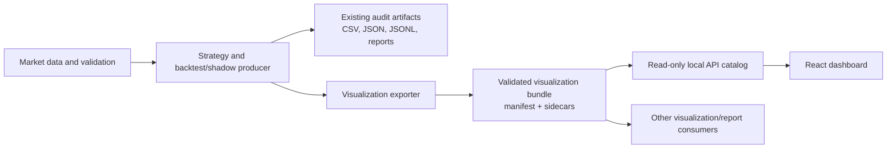

# Strategy Visualization Dashboard: Contract-First Plan

## 1. Purpose

The Strategy Visualization Dashboard is a read-only research interface for
historical backtests and shadow-trading results. Its primary design rule is:

> Strategy result generation must publish a validated, visualization-ready
> bundle. The dashboard must not reverse-engineer strategy-specific CSV and JSON
> files or recalculate trading indicators.

Existing research artifacts such as `backtest_report.json`,
`fixed_trades.csv`, `rrms_trades.csv`, summaries, and shadow JSONL logs remain
available for audit and analysis. The visualization bundle is an additive,
versioned interface between result producers and all visualization consumers.

This dashboard does not place orders, modify strategies, or grant paper/live
execution authority.

## 2. Objectives and Success Criteria

The first release must:

- Display completed OHLCV bars for every timeframe declared by a result bundle.
- Display producer-generated overlays such as Alligator Jaw, Teeth, Lips, and
  Heikin-Ashi candles.
- Plot entries, exits, stops, and targets from a canonical trade ledger.
- Compare fixed-risk and RRMS equity and drawdown series.
- Provide a searchable and sortable trade explorer whose selected row focuses
  the relevant chart interval.
- Display shadow decisions, rejected/accepted intents, active positions, closed
  shadow trades, and hard-risk status.
- Consume the same versioned contract for all supported strategies.
- Reject incomplete or invalid bundles rather than partially rendering them.
- Preserve the provenance and warnings required to interpret each research run.

The first release does not normalize specialized zone reviews, causal
diagnostics, cross-strategy comparisons, or order execution. These may be added
as new dataset kinds without changing the version 1 core objects.

## 3. Current-State Review

The existing result pipeline already provides useful raw ingredients:

- OHLCV market data uses ordered ISO-8601 UTC timestamps.
- Backtest trade ledgers share a common core trade shape.
- Reports contain strategy metadata, assumptions, warnings, and summary metrics.
- The deterministic research pipeline adds profile, input-validation, and run
  metadata.
- Shadow trading records decision cycles, intents, open positions, and closed
  outcomes in append-only JSONL files.

The original visualization proposal leaves several integration gaps:

- It makes the API server parse heterogeneous strategy artifacts and calculate
  indicators, duplicating producer logic and risking mismatched results.
- It shows a `trade_id` that current backtest ledgers do not generate.
- It does not define run identity, schema versioning, integrity hashes,
  provenance, capability discovery, or partial-write behavior.
- It defines summary metrics but not the equity and drawdown point series needed
  by the charts.
- It does not provide a normalized representation for shadow decisions and open
  positions.
- It does not state timestamp, null, numeric, ordering, or reconciliation rules.

The contract below closes these gaps at the result-generation boundary.

## 4. Architecture



Responsibilities are deliberately separated:

- Producers own strategy calculations, indicator calculations, trade results,
  equity, drawdown, risk outcomes, and source provenance.
- The visualization exporter normalizes and validates producer output.
- The API discovers and serves validated bundles. It does not infer missing
  strategy data or recalculate results.
- The dashboard maps canonical records to charts and tables. It owns
  presentation only.

## 5. Bundle Layout and Publication

Each completed backtest run or current shadow stream publishes:

```text
<result-directory>/
  backtest_report.json                 # existing audit output when applicable
  fixed_trades.csv                     # existing audit output when applicable
  rrms_trades.csv                      # existing audit output when applicable
  visualization/
    manifest.json
    data/
      candles-15m.json
      candles-1h.json
      overlays-15m.json
      overlays-1h.json
      trades-fixed.json
      trades-rrms.json
      performance-fixed.json
      performance-rrms.json
      shadow-state.json
```

Only files declared by the manifest are part of the bundle. Optional datasets
are omitted when they are not applicable.

The exporter writes and validates all sidecars first, then writes
`manifest.json` atomically as the final publication step. A directory without a
valid manifest is incomplete and must not appear in the API catalog.

## 6. Contract Conventions

Version 1 uses these rules across every object:

- `schema_version` is `"1.0.0"`.
- JSON property names use `snake_case`.
- Timestamps use UTC `YYYY-MM-DDTHH:MM:SSZ`.
- Timestamps within a time series are strictly ascending and unique.
- Numeric values must be finite JSON numbers. `NaN` and infinity are invalid.
- Undefined ratios, such as profit factor without a loss, use `null`.
- Prices are positive. Volume and monetary costs are non-negative.
- Enumerations are lowercase stable identifiers; display labels are separate.
- Dataset paths are relative to `visualization/` and may not contain absolute
  paths, drive letters, or `..`.
- Colors, screen coordinates, and component styling are not stored in data.
- Unknown additive properties may be ignored within the same major version.
  Removing or changing an existing field requires a new major version.

## 7. Manifest Contract

`manifest.json` is the bundle entry point:

```json
{
  "schema_version": "1.0.0",
  "bundle_id": "strategy_04_v1_spy_1h_15m_2026_07_16",
  "mode": "historical_backtest",
  "status": "complete",
  "generated_at": "2026-07-28T12:00:00Z",
  "run": {
    "run_id": "spy_1h_15m_2026_07_16",
    "strategy_id": "strategy_04",
    "strategy_version": "v1",
    "profile_id": null
  },
  "instrument": {
    "symbol": "SPY",
    "asset_class": "equity",
    "currency": "USD",
    "exchange": "ARCA",
    "contract_multiplier": 1.0,
    "price_precision": 2
  },
  "time": {
    "timestamp_timezone": "UTC",
    "session_timezone": "America/New_York",
    "first_timestamp": "2021-04-14T13:30:00Z",
    "last_timestamp": "2026-07-16T19:45:00Z"
  },
  "execution_authority": "none",
  "warnings": [
    {
      "code": "preliminary_research",
      "severity": "warning",
      "message": "Preliminary historical result; not approved for trading."
    }
  ],
  "provenance": {
    "market_data_source": "locally cached IBKR historical bars",
    "strategy_document": "strategies/strategy_04/v1/strategy.md",
    "input_validation_passed": true
  },
  "capabilities": {
    "timeframes": ["15m", "1h"],
    "sizing_variants": ["fixed", "rrms"],
    "overlay_ids": ["alligator_15m", "alligator_1h", "heikin_ashi_15m"],
    "has_shadow_state": false
  },
  "datasets": [
    {
      "dataset_id": "candles_15m",
      "kind": "candles",
      "timeframe": "15m",
      "variant": null,
      "path": "data/candles-15m.json",
      "media_type": "application/json",
      "record_count": 34200,
      "first_timestamp": "2021-04-14T13:30:00Z",
      "last_timestamp": "2026-07-16T19:45:00Z",
      "sha256": "<64 lowercase hexadecimal characters>"
    }
  ]
}
```

Required manifest information:

- Identity: schema version, bundle ID, mode, status, generation time, and run.
- Interpretation: instrument, time, authority, warnings, and provenance.
- Discovery: capabilities and dataset descriptors.
- Integrity: record counts, time bounds, and SHA-256 for every sidecar.

Allowed `mode` values are `historical_backtest` and `shadow`. Allowed `status`
is `complete`; incomplete work is represented by the absence of a manifest.

## 8. Dataset Contracts

### 8.1 Candles

Each timeframe has one `CandleSeriesV1` sidecar:

```json
{
  "schema_version": "1.0.0",
  "dataset_id": "candles_15m",
  "kind": "candles",
  "symbol": "SPY",
  "timeframe": "15m",
  "bars": [
    {
      "timestamp": "2026-04-23T15:45:00Z",
      "open": 550.25,
      "high": 552.10,
      "low": 549.80,
      "close": 551.90,
      "volume": 124500.0
    }
  ]
}
```

For every bar:

```text
low <= min(open, close) <= max(open, close) <= high
```

The dashboard converts UTC timestamps to chart-library epoch seconds through
one shared adapter.

### 8.2 Overlays

Producer-computed overlays use a generic `OverlaySeriesV1` format:

```json
{
  "schema_version": "1.0.0",
  "dataset_id": "overlays_15m",
  "kind": "overlays",
  "symbol": "SPY",
  "timeframe": "15m",
  "series": [
    {
      "series_id": "alligator_jaw_15m",
      "overlay_id": "alligator_15m",
      "label": "Jaw",
      "series_type": "line",
      "value_unit": "price",
      "points": [
        {
          "timestamp": "2026-04-23T15:45:00Z",
          "value": 548.50
        }
      ]
    }
  ]
}
```

Allowed version 1 series types are `line` and `candlestick`. Heikin-Ashi uses
candlestick points with `open`, `high`, `low`, and `close`. Alligator Jaw,
Teeth, and Lips are separate line series sharing one `overlay_id`.

Overlay values must come from the same producer implementation used by the
strategy. The API and dashboard never recompute them.

### 8.3 Trade Ledgers

Each sizing variant has one `TradeLedgerV1` sidecar:

```json
{
  "schema_version": "1.0.0",
  "dataset_id": "trades_fixed",
  "kind": "trades",
  "variant": "fixed",
  "trades": [
    {
      "trade_id": "spy_1h_15m_2026_07_16:fixed:000001",
      "status": "closed",
      "decision_timestamp": "2026-04-23T15:45:00Z",
      "entry_timestamp": "2026-04-23T15:45:00Z",
      "exit_timestamp": "2026-04-23T17:00:00Z",
      "side": "long",
      "rrms_tier": 0,
      "quantity": 70,
      "entry_price": 711.66,
      "stop_price": 709.54,
      "target_price": 713.78,
      "exit_price": 709.47,
      "exit_reason": "stop",
      "gross_pnl": -153.30,
      "costs": 0.75,
      "net_pnl": -154.05,
      "result_r": -1.038,
      "equity_before": 100000.00,
      "equity_after": 99845.95
    }
  ]
}
```

Historical ledgers contain closed trades. Shadow open positions use
`status: "open"` and set exit/result fields to `null`.

Backtest trade IDs are deterministic:

```text
<run_id>:<variant>:<six-digit one-based ordinal>
```

Shadow records use their existing `cycle_id` as the stable trade ID.

### 8.4 Performance Series

Each sizing variant has one `PerformanceSeriesV1` sidecar:

```json
{
  "schema_version": "1.0.0",
  "dataset_id": "performance_fixed",
  "kind": "performance",
  "variant": "fixed",
  "currency": "USD",
  "summary": {
    "starting_equity": 100000.0,
    "ending_equity": 100308.97,
    "trade_count": 42,
    "wins": 23,
    "losses": 19,
    "win_rate": 0.547619,
    "net_pnl": 308.97,
    "profit_factor": 1.104725,
    "average_r": 0.049811,
    "max_drawdown": 934.08,
    "max_drawdown_percent": 0.00931
  },
  "points": [
    {
      "timestamp": "2021-06-16T18:30:00Z",
      "trade_id": "spy_1h_15m_2026_07_16:fixed:000001",
      "equity": 99840.29,
      "peak_equity": 100000.0,
      "drawdown": 159.71,
      "drawdown_percent": 0.001597
    }
  ]
}
```

The exporter includes an initial-equity anchor at the first candle timestamp.
Subsequent points use trade exit timestamps. Performance points and ledger rows
must match by `trade_id`.

### 8.5 Shadow State

A shadow bundle has one current `ShadowStateV1` sidecar:

```json
{
  "schema_version": "1.0.0",
  "dataset_id": "shadow_state",
  "kind": "shadow_state",
  "stream_id": "strategy_01_v3_spy_shadow",
  "last_updated_at": "2026-07-28T12:00:00Z",
  "risk_status": "enabled",
  "decision_events": [
    {
      "cycle_id": "strategy_01_v3_bill_williams_alligator_rrms:SPY:2026-07-28T14:30:00Z",
      "decision_timestamp": "2026-07-28T14:30:00Z",
      "status": "no_signal",
      "reason": "no_eligible_v3_long_signal",
      "recorded_at": "2026-07-28T14:30:02Z"
    }
  ],
  "open_positions": [],
  "closed_trades": []
}
```

Allowed decision statuses are `no_signal`, `rejected`, and `accepted`.
`open_positions` and `closed_trades` reuse the canonical trade fields. Reason
codes remain stable identifiers; optional display text is separate.

The shadow exporter rewrites the current sidecar and publishes a new manifest
after every recorded cycle or position close. The dashboard polls an active
shadow manifest every 30 seconds and shows the last successful update time.

## 9. Validation and Reconciliation

The exporter rejects a bundle for:

- Invalid schema versions, required fields, enumerations, or numbers.
- Duplicate, unordered, or malformed timestamps.
- Invalid OHLC relationships.
- Manifest counts or time bounds that disagree with a sidecar.
- Sidecar digest mismatch.
- Dataset paths escaping the bundle directory.
- Duplicate dataset, trade, cycle, or series identifiers.
- Trade chronology where exit precedes entry.
- Non-positive quantity or invalid long/short stop relationships.
- Performance points that do not reconcile with the trade ledger.
- Summary counts, P&L, ending equity, or drawdown that do not reconcile.

Monetary and ratio reconciliation uses an absolute tolerance of `1e-6` before
display rounding. Source values remain unrounded in contract files.

Validation failure must:

1. Leave existing research/audit outputs intact.
2. Avoid publishing a new invalid manifest and preserve the last valid shadow
   snapshot.
3. Return a non-zero producer/export status.
4. Record a precise dataset and field error.

## 10. Result-Generation Integration

Create one shared exporter in `src/ai_trade/visualization_contract.py`.

Historical generation sequence:

1. Validate market-data inputs.
2. Run the strategy and backtest.
3. Write existing ledgers, summaries, and reports.
4. Add final run/profile/provenance metadata.
5. Build canonical candles, overlays, trades, and performance datasets.
6. Validate contract and reconciliation rules.
7. Write sidecars and publish the manifest last.
8. Include the visualization bundle in immutable archives and file hashes.

Existing producers may initially call an end-of-run adapter over completed
in-memory results and raw artifacts. New producers should construct canonical
objects directly. The adapter belongs to result generation, not the API server.

The shadow runner follows the same rules after each cycle and each
position-monitoring update.

## 11. Read-Only API

Run with:

```powershell
python -m ai_trade.server --host 127.0.0.1 --port 8080
```

Version 1 endpoints:

- `GET /api/runs`
  - Returns catalog entries for validated historical and shadow bundles.
  - Filters exactly by `mode`, `strategy_id`, `strategy_version`, and `symbol`.
- `GET /api/runs/{bundle_id}/manifest`
  - Returns the validated manifest.
- `GET /api/runs/{bundle_id}/datasets/{dataset_id}`
  - Returns only the sidecar declared for that dataset ID.
- `GET /health`
  - Returns service state and valid/invalid bundle counts.

API behavior:

- Bind to localhost by default.
- Treat bundle and dataset IDs as opaque identifiers.
- Serve only paths allowlisted by validated manifests.
- Return JSON errors with stable codes.
- Use manifest/sidecar SHA-256 values as `ETag` values.
- Do not calculate indicators, derive summaries, mutate files, or expose
  arbitrary paths.

## 12. Dashboard Behavior

The frontend remains React + Vite with TradingView Lightweight Charts. It
supports light/dark themes, keyboard navigation, and mobile-to-desktop widths.

### Run selection

- Filter by strategy, version, symbol, mode, and run.
- Show generation time, data range, authority, and warnings.
- Keep selected bundle and sizing variant in the URL.

### Main price chart

- Load selected candles and overlays lazily.
- Enable only capabilities declared by the manifest.
- Display entry/exit markers and stop/target lines.
- Selecting a trade fits a padded entry-to-exit interval.
- An open position focuses from entry to the latest completed candle.

### Performance chart

- Compare fixed and RRMS equity on one time axis.
- Show drawdown as an aligned lower pane.
- Use producer-generated points without recalculation.

### Trade explorer

- Search by trade ID, side, status, and exit reason.
- Sort by timestamps, R, P&L, holding period, and RRMS tier.
- Selecting a row updates the main chart.
- Preserve selection across compatible timeframes.

### Shadow monitor

- Show latest decision, reason, next decision window, risk status, active
  position, stop, target, tier, and refresh time.
- Separate no-signal, rejected, accepted/open, and closed outcomes.
- Keep research-only and `execution_authority: none` continuously visible.

### Missing or invalid data

- Hide controls for optional undeclared datasets.
- Show a contract error for declared-but-unavailable datasets.
- Never infer missing values or substitute zeroes.
- Keep the prior valid shadow snapshot with a stale indicator after refresh
  failure.

## 13. Testing

### Contract and exporter

- Representative Strategy 01, 02, and 04 backtests.
- Fixed/RRMS reconciliation and equity/drawdown curves.
- Equity, ETF, and futures multipliers.
- Empty ledgers and undefined ratios.
- Weekend-close and same-bar trades.
- Multiple timeframes and optional overlays.
- Deterministic IDs and sidecar contents.
- Manifest-last publication and raw-output preservation after failure.

### Invalid contracts

- Duplicate or unordered timestamps.
- Invalid OHLC, `NaN`, or infinity.
- Missing or duplicate IDs.
- Inconsistent P&L, equity, drawdown, summaries, or record counts.
- Unsafe paths, digest mismatches, and unsupported major versions.

### Shadow

- No signal, rejection, accepted intent, and open position.
- Target, stop, and weekend-close outcomes.
- Duplicate-cycle replay and open-to-closed transition.
- Refresh failure preserving the previous valid snapshot.

### API

- Catalog includes only complete validated bundles.
- Exact filtering.
- Dataset allowlisting and path-traversal rejection.
- Error contracts, ETag, conditional GET, and localhost defaults.

### Dashboard

- Timeframe and overlay switching.
- Fixed-versus-RRMS comparison.
- Trade focus and selection persistence.
- Empty results and missing optional datasets.
- Shadow polling and stale-state behavior.
- Keyboard access, screen-reader labels, themes, and narrow layouts.

## 14. Delivery Sequence

1. Add version 1 contract models, validation, fixtures, and reconciliation tests.
2. Add the exporter and integrate one representative historical run.
3. Integrate remaining supported backtest producers and immutable archives.
4. Add shadow-state export and transition tests.
5. Build the read-only API catalog and dataset serving.
6. Build the dashboard against fixtures, then connect it to the API.
7. Run end-to-end tests against representative Strategy 01, 02, and 04 outputs.

The contract and fixtures are the first deliverable. Backend and frontend work
must not proceed against undocumented, producer-specific data shapes.
