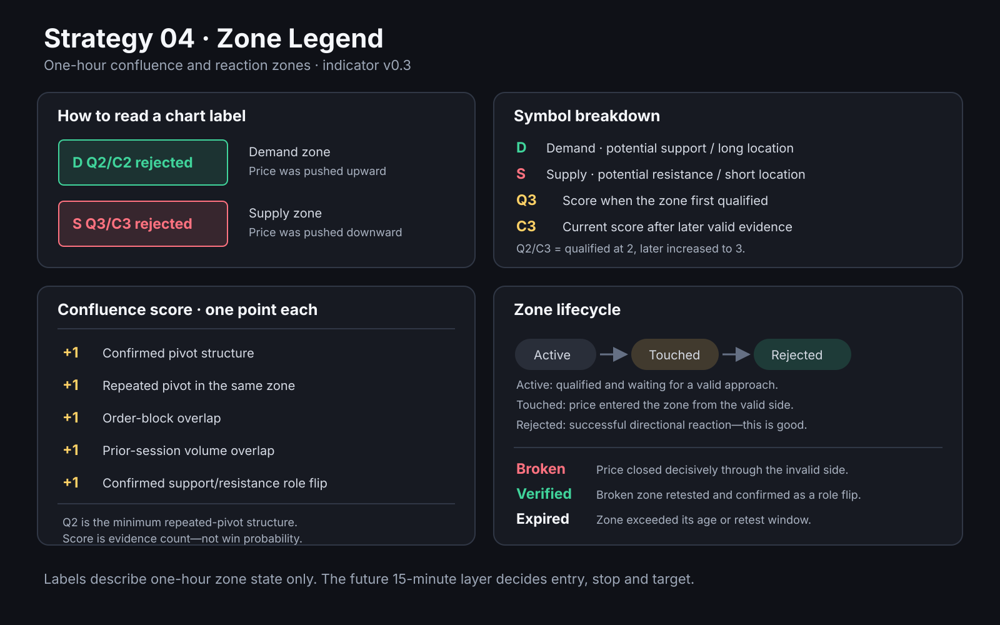

# Strategy 04 chart legend

## Zone notation

| Display | Meaning |
| --- | --- |
| D | Demand zone: potential support and the location where a future 15-minute long setup may be considered. |
| S | Supply zone: potential resistance and the location where a future 15-minute short setup may be considered. |
| Q2, Q3, etc. | Qualification score frozen when the zone first qualified. |
| C2, C3, etc. | Current confluence score, including valid evidence added after qualification. |
| Q2/C3 | The zone qualified with two points and later increased to three current confluence points. |

Q and C are evidence counts. They are not probabilities, confidence
percentages, or expected win rates.

## Confluence score

Each satisfied component adds one point:

| Component | Points |
| --- | ---: |
| Confirmed pivot structure | +1 |
| Repeated pivot in the same zone | +1 |
| Order-block overlap | +1 |
| Prior-session volume-reference overlap | +1 |
| Confirmed support/resistance role flip | +1 |

A v0.3 zone cannot qualify from unrelated evidence alone. It must contain both
the confirmed initial pivot and a second merged pivot reaction separated by at
least six completed one-hour bars. Consequently, Q2 normally represents the
minimum repeated-pivot structure.

## Lifecycle states

| State | Meaning |
| --- | --- |
| active | The qualified zone is waiting for a valid approach. |
| touched | Price entered or contacted the zone after approaching it from the valid side. |
| rejected | The zone successfully pushed price away in the expected direction. This is a positive reaction, not an invalid zone. |
| broken | Price closed decisively through the invalid side of the zone and its buffer. |
| verified | A broken zone was retested successfully from the opposite side, confirming a support/resistance role flip. |
| expired | The zone exceeded its permitted age or broken-zone retest window. |

## Reading the common labels

| Label | Interpretation |
| --- | --- |
| S Q3/C3 rejected | A supply zone qualified with three points, still has three points, and pushed price downward after a valid touch. |
| D Q2/C2 rejected | A demand zone qualified with the minimum two-point structure, still has two points, and pushed price upward after a valid touch. |
| D Q2/C3 active | A demand zone qualified at two, later gained another point, and is still waiting for a confirmed reaction. |

These one-hour labels describe zone state only. They are not automatic trade
orders. Strategy 04's later 15-minute layer decides whether and when to enter.

