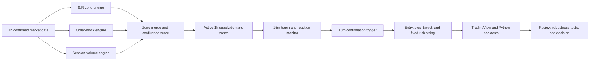

# Strategy 04 — Confluence Reaction Zones

## 1. Purpose

Build an original, transparent multi-timeframe strategy inspired by the visible
concepts in the supplied TradingView screenshots:

- One-hour support and resistance zones.
- Order blocks.
- Session-volume reference levels.
- Zone merging and confluence scoring.
- Break, flip, retest, and verification states.
- Fifteen-minute reaction signals and trade execution.

The project will not claim to reproduce the inaccessible indicator shown in the
screenshots. Every formula will be independently defined, documented, coded,
and tested.

## 2. High-level flow



## 3. Timeframe responsibilities

| Timeframe | Responsibility |
| --- | --- |
| 1 hour | Create, score, maintain, break, flip, and invalidate zones. |
| 15 minutes | Detect a reaction inside an already-existing 1h zone and execute the trade. |

The one-hour zone determines **where** a trade may occur. The fifteen-minute
trigger determines **whether and when** a trade occurs.

## 4. Baseline Strategy 04 v1 hypothesis

### Long

1. An active one-hour demand zone existed before the current 15m bar.
2. A 15m bar touches or enters that zone.
3. No completed one-hour candle has invalidated the zone.
4. Within a defined confirmation window, a 15m candle rejects the zone and
   closes back above its upper boundary.
5. Enter at the next 15m bar open.
6. Place the stop below the one-hour zone plus a volatility buffer.
7. Use a 1:1 take-profit target for the first controlled test.

### Short

1. An active one-hour supply zone existed before the current 15m bar.
2. A 15m bar touches or enters that zone.
3. No completed one-hour candle has invalidated the zone.
4. Within a defined confirmation window, a 15m candle rejects the zone and
   closes back below its lower boundary.
5. Enter at the next 15m bar open.
6. Place the stop above the one-hour zone plus a volatility buffer.
7. Use a 1:1 take-profit target for the first controlled test.

## 5. Baseline trading controls

- First research instrument: SPY.
- Fixed risk: 0.15% of simulated equity per trade.
- Test long and short directions separately and together.
- No entry during the first regular-session hour.
- No entry during the final regular-session hour.
- No Friday entries.
- Close open positions before the weekend.
- Include commission and slippage.
- Do not apply RRMS until fixed-risk expectancy is positive and robust.
- Only one open position at a time in the baseline test.
- Initially allow one trade per zone activation to prevent repeated entries
  from dominating the results.

## 6. One-hour zone engines

### 6.1 Confirmed support/resistance

Candidate inputs:

- Confirmed pivot highs and lows.
- Minimum left/right confirmation bars.
- ATR-normalized zone width.
- Minimum number of touches.
- Minimum time separation between touches.
- Wick rejection strength.
- Minimum distance between separate zones.

The chosen formula and parameters must be locked before the out-of-sample test.

### 6.2 Order blocks

Proposed independent definition:

1. Identify a confirmed break of prior swing structure.
2. Require displacement greater than a defined ATR threshold.
3. Select the final opposing candle before the displacement.
4. Use a documented part of that candle as the zone boundary.
5. Keep the block active until its explicit invalidation condition occurs.

Order blocks will be tested as an additional zone source, not assumed to add
value.

### 6.3 Session-volume references

Candidate components:

- Session point of control.
- Value-area high.
- Value-area low.
- High-volume price clusters.

The Pine and Python implementations must use a documented approximation that
can be reproduced from available historical data. SPY is the first instrument
because centralized exchange volume is more suitable for this comparison than
broker-specific forex volume.

## 7. Confluence and merging

Each independent source can contribute one point:

| Evidence | Initial score |
| --- | ---: |
| Confirmed pivot S/R | 1 |
| Order block | 1 |
| Session-volume reference | 1 |
| Broken-zone retest or role flip | 1 |
| Higher-quality repeated reaction | 1 |

Initial candidate rule: display and trade only zones supported by at least two
independent sources.

Nearby zones will be merged using an ATR-normalized distance. A merged zone
must retain the identity and availability time of every source used in its
score.

## 8. Zone lifecycle

```text
candidate
  → confirmed
  → active
  → touched
      → rejected
      → broken
          → flipped
          → retested
          → verified
  → invalidated
```

Every saved zone record must include:

- Stable zone identifier.
- Direction: demand or supply.
- Lower and upper boundary.
- Source components.
- Confluence score.
- Origin timestamp.
- Availability timestamp.
- First touch and later retest timestamps.
- Break and role-flip timestamps.
- Invalidation timestamp and reason.

## 9. Non-repainting and no-look-ahead contract

1. A pivot-derived zone cannot be used until all required right-side
   confirmation bars have completed.
2. Higher-timeframe values must be exposed to 15m logic only when they were
   genuinely available.
3. Historical drawings may begin at an earlier origin candle, but the stored
   `available_timestamp` controls trading eligibility.
4. All decisions use completed bars.
5. Entries occur no earlier than the bar after confirmation.
6. Pine higher-timeframe requests must use look-ahead-disabled behavior.
7. Python must process zone state chronologically rather than calculating final
   zones over the entire dataset and projecting them backward.

## 10. Development stages

### Stage A — Specification

- Lock formulas and default parameters.
- Create examples of valid/invalid zones.
- Define reaction, break, flip, retest, and invalidation precisely.
- Create unit-test scenarios before historical evaluation.

### Stage B — Private Pine indicator

- Plot raw component zones individually.
- Plot merged confluence zones.
- Display source score and lifecycle state.
- Display zone-availability markers.
- Do not create trading orders yet.

Definition of done: at least 30 historical zones are manually inspected, and
no zone is usable before its recorded availability time.

### Stage C — Pine strategy

- Add the 15m entry trigger.
- Add next-bar entry, zone-based stop, 1:1 target, costs, and session rules.
- Run the TradingView Strategy Tester on standard candles.
- Export or record the signal ledger needed for reconciliation.

### Stage D — Python implementation

- Use cached one-hour and fifteen-minute IBKR bars.
- Reproduce each zone engine and lifecycle as deterministic functions.
- Save zones, signals, trades, summaries, and charts.
- Add Strategy 04 to the standard research workflow.

### Stage E — Reconciliation

- Select at least 20 common TradingView and Python setups.
- Compare zone boundaries, availability times, touches, triggers, entries,
  stops, targets, and exits.
- Explain every mismatch; do not silently tune one engine to the other.

### Stage F — Research

1. Fixed-risk SPY baseline.
2. Long-only, short-only, and combined results.
3. Component ablation:
   - S/R only.
   - S/R plus order blocks.
   - S/R plus volume.
   - Full confluence.
4. Confluence threshold comparison.
5. In-sample versus untouched out-of-sample period.
6. Walk-forward and Monte Carlo analysis.
7. QQQ and DIA validation only after SPY rules are frozen.

### Stage G — Product integration

- Add the strategy, versions, reports, trade ledgers, and saved charts to the
  Streamlit Strategy Research Library.
- Keep the initial UI read-only.

### Stage H — Community release

- Publish only after the indicator is stable and non-repainting behavior is
  documented.
- Use an original name and description.
- Publish Pine v6 source with a clear licence.
- Publish the Python reference implementation and reproducible research files.
- Do not claim equivalence to the inaccessible indicator from the screenshots.
- Do not advertise profitability or imply that zones guarantee reactions.

## 11. Decisions to lock before coding

1. Pivot confirmation length and zone-width formula.
2. Exact order-block boundaries and displacement threshold.
3. Reproducible session-volume method.
4. Minimum confluence score.
5. Maximum number and age of active zones.
6. Exact 15m rejection definition.
7. Number of bars allowed between zone touch and confirmation.
8. Zone invalidation buffer.
9. Stop buffer.
10. Whether v1 requires a 15m swing break or saves it for v2.

## 12. Recommended immediate next step

Create historical examples for SPY and use them to lock the support/resistance
engine and the 15m reaction definition before implementing order blocks or
volume confluence. This keeps the first experiment interpretable and prevents a
large combined indicator from hiding which component actually works.
